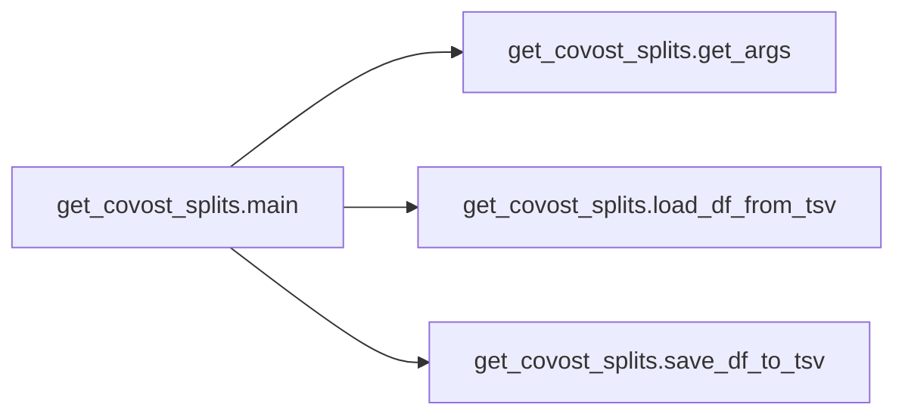
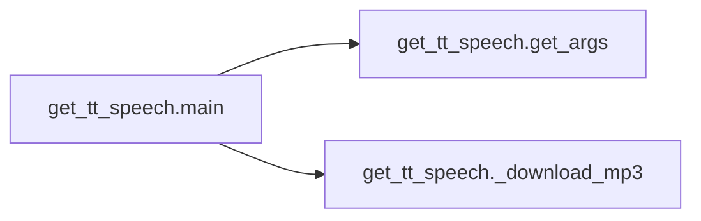

# Key Objects

[_Documentation generated by Documatic_](https://www.documatic.com)

<!---Documatic-section-get_covost_splits.load_df_from_tsv-start--->
## get_covost_splits.load_df_from_tsv

<!---Documatic-section-load_df_from_tsv-start--->
<!---Documatic-block-get_covost_splits.load_df_from_tsv-start--->
<details>
	<summary><code>get_covost_splits.load_df_from_tsv</code> code snippet</summary>

```python
def load_df_from_tsv(path: Path):
    return pd.read_csv(path, sep='\t', header=0, encoding='utf-8', escapechar='\\', quoting=csv.QUOTE_NONE, na_filter=False)
```
</details>
<!---Documatic-block-get_covost_splits.load_df_from_tsv-end--->
<!---Documatic-section-load_df_from_tsv-end--->

# #
<!---Documatic-section-get_covost_splits.load_df_from_tsv-end--->

<!---Documatic-section-get_tt_speech._download_mp3-start--->
## get_tt_speech._download_mp3

<!---Documatic-section-_download_mp3-start--->
<!---Documatic-block-get_tt_speech._download_mp3-start--->
<details>
	<summary><code>get_tt_speech._download_mp3</code> code snippet</summary>

```python
def _download_mp3(root: str, lang: str, s_id: str, overwrite=False):
    path = op.join(root, f'{s_id}.mp3')
    if not overwrite and op.isfile(path):
        return
    url = f'https://audio.tatoeba.org/sentences/{lang}/{s_id}.mp3'
    try:
        urllib.request.urlretrieve(url, path)
    except Exception as e:
        print(e, url)
        return str(e)
```
</details>
<!---Documatic-block-get_tt_speech._download_mp3-end--->
<!---Documatic-section-_download_mp3-end--->

# #
<!---Documatic-section-get_tt_speech._download_mp3-end--->

<!---Documatic-section-get_covost_splits.get_v2_split-start--->
## get_covost_splits.get_v2_split

<!---Documatic-section-get_v2_split-start--->
<!---Documatic-block-get_covost_splits.get_v2_split-start--->
<details>
	<summary><code>get_covost_splits.get_v2_split</code> code snippet</summary>

```python
def get_v2_split(df: pd.DataFrame, split: str):
    if split == 'train':
        return df[(df['split'] == split) | (df['split'] == f'{split}_covost')]
    else:
        return df[df['split'] == split]
```
</details>
<!---Documatic-block-get_covost_splits.get_v2_split-end--->
<!---Documatic-section-get_v2_split-end--->

# #
<!---Documatic-section-get_covost_splits.get_v2_split-end--->

<!---Documatic-section-get_tt_speech.get_args-start--->
## get_tt_speech.get_args

<!---Documatic-section-get_args-start--->
<!---Documatic-block-get_tt_speech.get_args-start--->
<details>
	<summary><code>get_tt_speech.get_args</code> code snippet</summary>

```python
def get_args():
    parser = argparse.ArgumentParser()
    parser.add_argument('--root', type=str, default='data/tt/mp3', help='root path for MP3 files')
    return parser.parse_args()
```
</details>
<!---Documatic-block-get_tt_speech.get_args-end--->
<!---Documatic-section-get_args-end--->

# #
<!---Documatic-section-get_tt_speech.get_args-end--->

<!---Documatic-section-get_covost_splits.main-start--->
## get_covost_splits.main

<!---Documatic-section-main-start--->


### Object Calls

* get_covost_splits.get_args
* get_covost_splits.load_df_from_tsv
* get_covost_splits.save_df_to_tsv

<!---Documatic-block-get_covost_splits.main-start--->
<details>
	<summary><code>get_covost_splits.main</code> code snippet</summary>

```python
def main():
    args = get_args()
    (ver, src, tgt) = (args.version, args.src_lang, args.tgt_lang)
    assert src != tgt and 'en' in {src, tgt}
    if src == 'en':
        assert tgt in EN_XX_LANGUAGES[ver]
    else:
        assert src in XX_EN_LANGUAGES[ver]
    root = Path(args.root)
    tsv_prefix = TSV_PREFIX[ver]
    cv_tsv = load_df_from_tsv(args.cv_tsv)
    covost_tsv = load_df_from_tsv(root / f'{tsv_prefix}.{src}_{tgt}.tsv')
    df = pd.merge(left=cv_tsv[['path', 'sentence', 'client_id']], right=covost_tsv[['path', 'translation', 'split']], how='inner', on='path')
    for split in SPLITS:
        get_split = {'1': get_v1_split, '2': get_v2_split}.get(ver, None)
        assert get_split is not None
        cur_df = get_split(df, split)
        cur_df = cur_df[['path', 'sentence', 'translation', 'client_id']]
        save_df_to_tsv(cur_df, root / f'{tsv_prefix}.{src}_{tgt}.{split}.tsv')
```
</details>
<!---Documatic-block-get_covost_splits.main-end--->
<!---Documatic-section-main-end--->

# #
<!---Documatic-section-get_covost_splits.main-end--->

<!---Documatic-section-get_covost_splits.save_df_to_tsv-start--->
## get_covost_splits.save_df_to_tsv

<!---Documatic-section-save_df_to_tsv-start--->
<!---Documatic-block-get_covost_splits.save_df_to_tsv-start--->
<details>
	<summary><code>get_covost_splits.save_df_to_tsv</code> code snippet</summary>

```python
def save_df_to_tsv(dataframe, path: Path):
    dataframe.to_csv(path, sep='\t', header=True, index=False, encoding='utf-8', escapechar='\\', quoting=csv.QUOTE_NONE)
```
</details>
<!---Documatic-block-get_covost_splits.save_df_to_tsv-end--->
<!---Documatic-section-save_df_to_tsv-end--->

# #
<!---Documatic-section-get_covost_splits.save_df_to_tsv-end--->

<!---Documatic-section-get_tt_speech.main-start--->
## get_tt_speech.main

<!---Documatic-section-main-start--->


### Object Calls

* get_tt_speech.get_args
* get_tt_speech._download_mp3

<!---Documatic-block-get_tt_speech.main-start--->
<details>
	<summary><code>get_tt_speech.main</code> code snippet</summary>

```python
def main():
    args = get_args()
    if not op.isdir(args.root):
        os.makedirs(args.root)
    for lang in LANG_CODE_2_TO_3:
        print(f'Downloading {lang} speeches...')
        lang_3 = LANG_CODE_2_TO_3[lang]
        with open(f'data/tt/tatoeba20191004.s2t.{lang}_en.tsv') as f:
            next(f)
            ids = [r.strip().split('\t')[0] for r in f]
        for i in tqdm(ids):
            _download_mp3(args.root, lang_3, i)
```
</details>
<!---Documatic-block-get_tt_speech.main-end--->
<!---Documatic-section-main-end--->

# #
<!---Documatic-section-get_tt_speech.main-end--->

<!---Documatic-section-get_covost_splits.get_v1_split-start--->
## get_covost_splits.get_v1_split

<!---Documatic-section-get_v1_split-start--->
<!---Documatic-block-get_covost_splits.get_v1_split-start--->
<details>
	<summary><code>get_covost_splits.get_v1_split</code> code snippet</summary>

```python
def get_v1_split(df: pd.DataFrame, split: str):
    return df[(df['split'] == split) | (df['split'] == f'{split}_covost')]
```
</details>
<!---Documatic-block-get_covost_splits.get_v1_split-end--->
<!---Documatic-section-get_v1_split-end--->

# #
<!---Documatic-section-get_covost_splits.get_v1_split-end--->

<!---Documatic-section-get_covost_splits.get_args-start--->
## get_covost_splits.get_args

<!---Documatic-section-get_args-start--->
<!---Documatic-block-get_covost_splits.get_args-start--->
<details>
	<summary><code>get_covost_splits.get_args</code> code snippet</summary>

```python
def get_args():
    parser = argparse.ArgumentParser()
    parser.add_argument('--version', '-v', type=str, choices=['1', '2'], required=True, help='CoVoST version')
    parser.add_argument('--src-lang', '-s', type=str, required=True, help='source language code')
    parser.add_argument('--tgt-lang', '-t', type=str, required=True, help='target language code')
    parser.add_argument('--root', '-d', type=str, required=True, help='root path to translation TSV and output TSVs')
    parser.add_argument('--cv-tsv', type=str, required=True, help='path to validated.tsv from Common Voice')
    return parser.parse_args()
```
</details>
<!---Documatic-block-get_covost_splits.get_args-end--->
<!---Documatic-section-get_args-end--->

# #
<!---Documatic-section-get_covost_splits.get_args-end--->

[_Documentation generated by Documatic_](https://www.documatic.com)